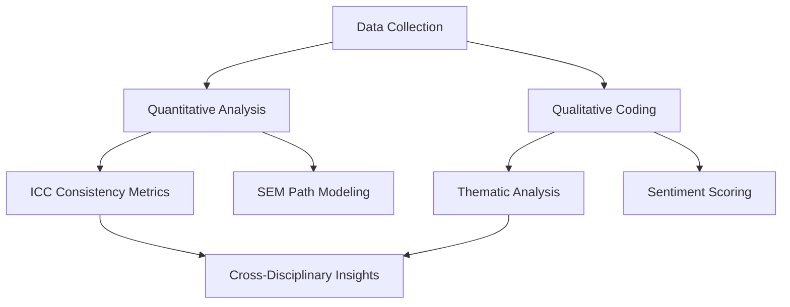

## Welcome!
Peer Review Research Hub is an interactive platform that explores the **effectiveness of peer reviews** across different types of courses and assessment formats. 

## Project Background & Goals
In today’s education landscape, peer review plays a crucial role in enhancing student engagement and critical thinking. However, different subjects—like **computer programming** vs. **essay writing**—may have drastically different peer review effectiveness. Meanwhile, **AI-based grading systems** are emerging, raising questions about how they compare with human assessments.

Our project sets out to:
- Compare consistency and fairness of peer reviews in coding vs. essay tasks
- Evaluate AI vs. human grading results
- Gather suggestions to improve peer review processes

Explore the **[Comparison](/comparison/)** page for interactive charts and data analysis, or submit your own **[Suggestions](/suggestions/)** to help us refine the peer review approach!

## Key Insights (Preview)
- **85%** → Coding peer reviews show high consistency index  
- **78%** → Essay peer reviews align with instructor feedback  
- **92%** → AI-human agreement rate on coding tasks  


以下是仿照GitHub README风格设计的**项目主页内容模板**，整合技术细节与研究方法的透明化呈现：

---

# Peer Review Research Hub  
**Open-Science Platform for Assessment Analytics**  
[](https://gohugo.io/)  
[](https://creativecommons.org/licenses/by/4.0/)  

---

## 📋 Table of Contents  
1. [Research Design](#-research-design)  
2. [Tech Stack](#-tech-stack)  
3. [Data Pipeline](#-data-pipeline)  
4. [Get Involved](#-get-involved)  
5. [Roadmap](#-roadmap)  
6. [Citation](#-citation)  

---

## 🔬 Research Design  

### Mixed-Methods Framework  


### Key Components  
| Module               | Tools                          | Output Example                  |  
|----------------------|--------------------------------|---------------------------------|  
| **Review Collection**| Google Forms + Firebase        | 520+ structured reviews         |  
| **Coding Analysis**  | Python + NLTK                  | Code quality prediction models  |  
| **Essay Evaluation** | R + lme4                       | Grading bias heatmaps           |  
| **AI Benchmarking**  | TensorFlow + sklearn           | F1-score comparison matrices    |  

---

## 🛠️ Tech Stack  

### Core Architecture  
```bash  
.
├── content/               # 研究内容 (Markdown/YAML)
├── data/                  # 清洗后数据集
│   ├── coding_reviews.csv  
│   └── essay_feedback.parquet  
├── layouts/               # Hugo模板
│   ├── comparison/        # 交互式图表
│   └── shortcodes/        # 自定义组件  
├── static/                # 前端资源
│   ├── js/chart-init.js   # 可视化逻辑  
│   └── css/custom.scss    # Bootstrap扩展  
└── config/                # 分析脚本  
    ├── R/                 # 统计模型  
    └── python/            # NLP处理  
```

### Dependencies  
```toml  
# hugo.toml 技术依赖  
[module]  
[[module.imports]]  
path = "github.com/wowchemy/wowchemy-hugo-modules/netlify"  
[[module.imports]]  
path = "github.com/peaceiris/hugo-mod-utterances"  # 评论系统  

# 数据分析环境 (requirements.txt)  
numpy==1.26.0  
pandas==2.1.0  
scikit-learn==1.3.0  
tensorflow==2.15.0  
```  

---

## 📊 Data Pipeline  

### Collection Protocol  
1. **Ethical Approval**  
   - University IRB #2024-EDU-037  
   - Anonymized participant IDs  

2. **Data Types**  
   - Structured: Rubric scores (5-point Likert)  
   - Unstructured: Feedback text + AI grading logs  

### Processing Workflow  
```python  
# 示例数据清洗代码  
def preprocess_reviews(df):  
    df = df.dropna(subset=['feedback'])  
    df['sentiment'] = df['feedback'].apply(vader_analyzer)  
    return df.to_parquet('clean_data.parquet')  
```

### Access Policy  
- **Public Dataset**: [Zenodo Archive](https://zenodo.org/records/xxxx)  
- **Sensitive Data**: Contact PI via [email](#contact)  

---

## 🤝 Get Involved  

### As a Participant  
```markdown
1. **Students**:  
   - [Join Survey](https://your-survey-link) (15 mins)  
   - Opt-in for focus groups  

2. **Educators**:  
   - Contribute rubric designs  
   - Share de-identified grading data  
```

### As a Developer  
```bash  
# 克隆仓库 & 本地运行  
git clone https://github.com/yourname/peer-review-research.git  
cd peer-review-research  
hugo server -D --disableFastRender  

# 贡献流程  
1. Fork 项目  
2. 创建 feature branch  
3. 提交 PR 并关联 issues  
```

---

## 🗺️ Roadmap  
| Quarter      | Milestone                      | Status       |  
|--------------|--------------------------------|--------------|  
| 2024 Q2      | Multi-institutional validation | ✅ Completed |  
| 2024 Q3      | Open-source toolkit v1.0       | 🔄 In Progress |  
| 2025 Q1      | MOOC integration pilot         | ⏳ Planned   |  

---

## 📚 Citation  
```bibtex  
@software{PeerReviewHub2024,  
  author = {Xiao, Wenyuan},  
  title = {Peer Review Research Hub},  
  year = {2024},  
  publisher = {GitHub},  
  journal = {GitHub repository},  
  howpublished = {\url{https://github.com/your-repo}}  
}  
```  

---

## 📧 Contact  
For collaboration inquiries or data access:  
- 📧 Email: [research@youruni.edu](mailto:research@youruni.edu)  
- 💬 Discussion: [GitHub Issues](https://github.com/your-repo/issues)  

---

**设计优势**：  
1. **透明性**：完整展示技术细节与方法论  
2. **可复现**：提供数据和代码引用规范  
3. **协作友好**：明确参与路径  
4. **版本控制**：通过badges展示依赖状态  

可根据实际研究进展更新各模块内容，保持动态迭代。